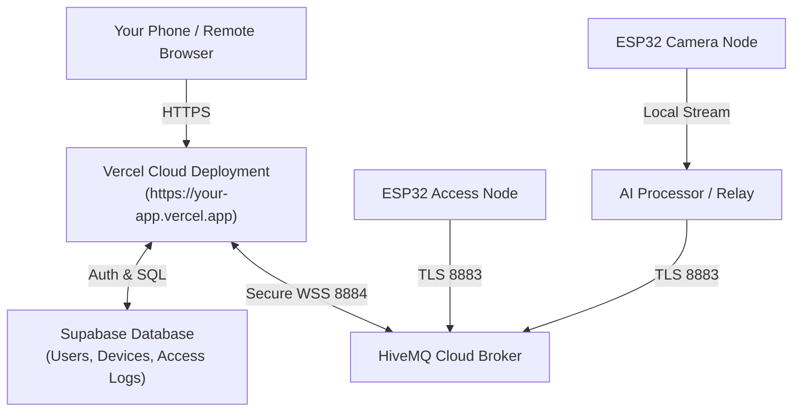

# SecureHome Cloud Deployment Guide

This guide walks you through deploying **SecureHome** to the cloud so you can log in, view your live camera feeds, and operate door locks from **any phone, tablet, or laptop anywhere in the world**.

---

## Architecture Overview



---

## Step 1: Database Setup (Supabase — Free Tier)

1. Go to [supabase.com](https://supabase.com) and create a free account.
2. Click **New Project** and name it `securehome-cloud`.
3. Once the project finishes provisioning:
   * Navigate to the **SQL Editor** tab in the left sidebar.
   * Click **New Query**.
   * Open [`securehome-system/command-center/web-dashboard/supabase/schema.sql`](securehome-system/command-center/web-dashboard/supabase/schema.sql) from this repo.
   * Paste the entire content into the SQL editor and click **Run**.
4. Retrieve your API credentials:
   * Go to **Project Settings** (gear icon) → **API**.
   * Copy the **Project URL** (e.g. `https://xyzcompany.supabase.co`).
   * Copy the **Project API keys: `anon` `public`** key.

---

## Step 2: Deploy to Vercel (Free Tier)

1. Push your latest code to GitHub:
   ```bash
   git add .
   git commit -m "feat: cloud multi-tenant architecture and deployment config"
   git push origin main
   ```
2. Go to [vercel.com](https://vercel.com) and log in with GitHub.
3. Click **Add New... → Project**.
4. Select your `modular-home-security` repository.
5. In the configuration screen:
   * **Framework Preset**: Next.js (automatically detected)
   * **Root Directory**: Click **Edit** and select `securehome-system/command-center/web-dashboard` (required for monorepo structure).
6. Expand **Environment Variables** and add the following 5 variables:

| Key | Value | Description |
|---|---|---|
| `NEXT_PUBLIC_MQTT_BROKER_URL` | `wss://3f93b8059c60417c83f4edf58d1fa61d.s1.eu.hivemq.cloud:8884/mqtt` | HiveMQ WebSocket Endpoint |
| `NEXT_PUBLIC_MQTT_USER` | `simplicity005` | HiveMQ Username |
| `NEXT_PUBLIC_MQTT_PASS` | `Hey@Simplicity` | HiveMQ Password |
| `NEXT_PUBLIC_SUPABASE_URL` | `https://your-project.supabase.co` | Your Supabase Project URL |
| `NEXT_PUBLIC_SUPABASE_ANON_KEY` | `eyJhbGciOi...` | Your Supabase Public Anon Key |

7. Click **Deploy**. In under 2 minutes, Vercel will give you a public URL (e.g. `https://modular-home-security.vercel.app`).

---

## Step 3: Using the Cloud Dashboard

1. Open your Vercel URL on your phone or laptop.
2. **Sign Up / In**:
   * Click **Create Account** to register your email and password.
   * *(Note: You can also click **Instant Demo Mode** to preview the dashboard immediately).*
3. **Your Claim Token**:
   * Click your user profile in the top-right corner.
   * Copy your unique **Pairing Claim Token**.
4. **Pairing Hardware**:
   * Click **Pair Device** (`+` button).
   * Choose **Vision Node (Camera)** or **Access Node (Door Lock)**.
   * Enter the hardware UID (e.g., `ESP32_CAM_01` or `ESP32_ACCESS_01`).
   * Enter the friendly name (e.g., `Front Entrance Deadbolt`).
   * Click **Register Device**.

---

## Step 4: Connecting Hardware from Home

* **ESP32 Nodes**: Connect to HiveMQ Cloud with TLS port `8883`.
* **Camera Stream**:
  * Your AI Processor runs on your home PC or Raspberry Pi on the same Wi-Fi as your ESP32-CAM.
  * The AI Processor creates an ngrok tunnel relay and publishes the live relay URL to HiveMQ Cloud.
  * Your Vercel cloud dashboard automatically receives the relay URL via MQTT and displays the live video stream anywhere in the world!
