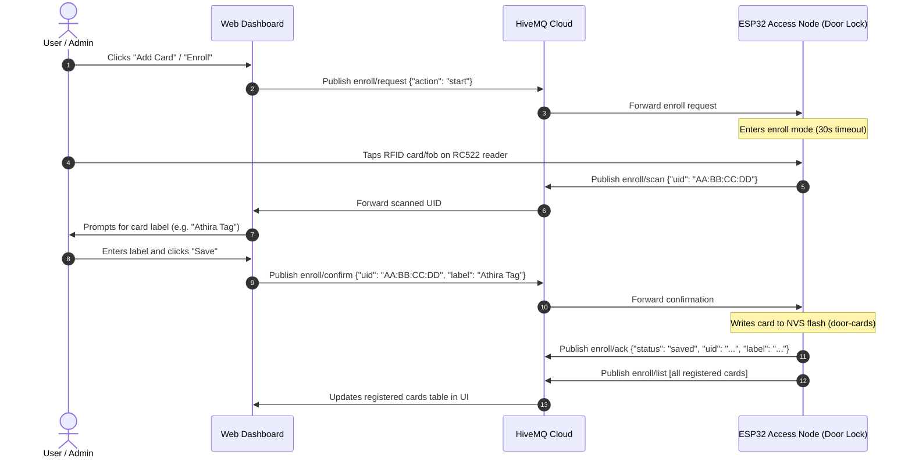

# 🚪 Node 3: Access Node / Door Lock (ESP32 Dev Board)

**Assigned to:** Athira (Hardware / Embedded)  
**Status:** ✅ **Implemented** (`AccessNode/AccessNode.ino`)

---

## 📂 Project Structure

```
securehome-system/access-node/
├── AccessNode/
│   └── AccessNode.ino        # Main ESP32 sketch (RFID, Keypad, Servo, WiFiManager, MQTT, NVS Registry)
├── README.md                 # Setup, pinout notes & flashing guide (You are here)
└── .gitignore                # Arduino & VSCode build artifacts
```

> [!NOTE]
> In the Arduino IDE, the primary `.ino` sketch must reside inside a directory with the exact matching name (`AccessNode/AccessNode.ino`).

---

## 📋 Responsibilities & Hardware Specs

- **Microcontroller:** ESP32 30-Pin Dev Board (`ESP-WROOM-32`).
- **Peripherals:**
  1. **RC522 RFID Module (SPI):** 13.56 MHz contactless reader for Mifare Classic tags/fobs. Operates strictly at **3.3V logic** (never connect VCC to 5V).
  2. **Matrix Membrane Keypad:** 4x3 configuration (Rows: GPIO 13, 14, 27, 26 | Columns: GPIO 25, 33, 32). Supports PIN entry and emergency factory resets.
  3. **MG90S Micro Servo:** Metal-gear deadbolt actuator driven via 50Hz PWM on GPIO 16 (powered via external 5V rail / VIN with shared ground).
- **Wiring & Power Reference:** See [docs/wiring-diagrams/pinouts.md](../docs/wiring-diagrams/pinouts.md).

---

## 🧰 Required Arduino IDE Libraries

Install the following libraries via the **Arduino IDE Library Manager** (`Ctrl+Shift+I` / `Cmd+Shift+I`):

1. **WiFiManager** (by tzapu) — Captive portal provisioning
2. **PubSubClient** (by Nick O'Leary) — MQTT broker communication
3. **MFRC522** (by GithubCommunity) — SPI RFID reader communication
4. **Keypad** (by Mark Stanley, Alexander Brevig) — Matrix keypad scanning
5. **ESP32Servo** (by Kevin Harrington, John K. Bennett) — Hardware PWM servo control
6. **ArduinoJson** (by Benoît Blanchon) — v6 or v7 cross-compatible JSON serialization

---

## 📌 Pinout Map (Strapping-Safe)

> [!IMPORTANT]
> The RC522 Chip Select (SDA/SS) pin is intentionally routed to **GPIO 21** instead of the standard VSPI default (GPIO 5). GPIO 5 is an ESP32 strapping pin that can interfere with bootloader timing if pulled low during startup.

| Peripheral | Pin | ESP32 GPIO | Purpose | Notes |
| :--- | :--- | :--- | :--- | :--- |
| **RC522 RFID** | VCC | **3V3** | 3.3V Power | ⚠️ Do NOT connect to 5V rail |
| | RST | **GPIO 22** | Reset | Hardware reset line |
| | GND | **GND** | Ground | Common system ground |
| | MISO | **GPIO 19** | SPI MISO | VSPI hardware SPI bus |
| | MOSI | **GPIO 23** | SPI MOSI | VSPI hardware SPI bus |
| | SCK | **GPIO 18** | SPI Clock | VSPI hardware SPI bus |
| | SDA (SS) | **GPIO 21** | Chip Select | Strapping-safe selection (avoids GPIO 5) |
| **Keypad (4x3)** | Row 1 | **GPIO 13** | Matrix Row 1 | Keys: 1, 2, 3 |
| | Row 2 | **GPIO 14** | Matrix Row 2 | Keys: 4, 5, 6 |
| | Row 3 | **GPIO 27** | Matrix Row 3 | Keys: 7, 8, 9 |
| | Row 4 | **GPIO 26** | Matrix Row 4 | Keys: *, 0, # |
| | Col 1 | **GPIO 25** | Matrix Col 1 | Column 1 |
| | Col 2 | **GPIO 33** | Matrix Col 2 | Column 2 |
| | Col 3 | **GPIO 32** | Matrix Col 3 | Column 3 |
| **MG90S Servo** | Signal | **GPIO 16** | PWM Signal | 50Hz PWM (500µs – 2400µs pulse range) |
| | VCC | **5V / VIN** | 5V Power | High-current rail with decoupling capacitor |
| | GND | **GND** | Ground | Common system ground |

---

## 🚀 First-Time Provisioning Workflow

1. Power on the ESP32 Access Node.
2. If Wi-Fi is unconfigured or the saved broker is unreachable, the node starts an access point: **`ESP32-DoorLock-Setup`**.
3. Connect your smartphone or laptop to the **`ESP32-DoorLock-Setup`** network.
4. When the captive portal launches (or navigate to `192.168.4.1`):
   - Select your **Home Wi-Fi SSID** and enter the **Password**.
   - **MQTT Broker Host:** Enter your HiveMQ Cloud hostname (e.g. `xxxx.s1.eu.hivemq.cloud`).
   - **MQTT Username & Password:** Enter your HiveMQ Cloud credentials.
   - **Account Claim Token:** Enter the claim token from your Web Dashboard user profile menu.
   - **Device UID:** Set a unique node ID (default: `ESP32_ACCESS_01`).
5. Click **Save**. The ESP32 commits all credentials to NVS flash memory (`door-cfg` namespace), connects to Wi-Fi, establishes a TLS connection to HiveMQ Cloud on port `8883`, publishes its retained status, and synchronizes its card registry.

---

## 🛡️ Autonomous Safety & Zero-Lockout Architecture

- **Zero-Lockout Guarantee:** The firmware executes RFID and keypad authentication routines (`checkRFID()` and `checkKeypad()`) in a non-blocking loop (~10ms cadence). If the Wi-Fi router, local network, internet, or MQTT broker goes offline, the physical door lock continues to operate seamlessly with local cards and PINs.
- **Background Reconnection:** Reconnection attempts for MQTT (every 5s) and Wi-Fi (every 10s) are non-blocking and never halt local peripheral scanning.
- **Auto-Relock:** Unlocking via RFID, PIN, or remote dashboard command rotates the servo to `90°` (unlocked), starts an autonomous 5-second timer (`UNLOCK_HOLD_MS = 5000`), and automatically returns the deadbolt to `0°` (locked).

---

## 💳 Dynamic RFID Card Registry (NVS Whitelist)

The Access Node features a non-volatile, over-the-air card management registry stored in the ESP32 flash memory (`door-cards` namespace):

- **Capacity:** Up to **20 enrolled RFID cards** (`MAX_ENROLLED_CARDS = 20`).
- **Data Model:** Each entry stores the hex card UID (e.g. `B4:A1:9F:32`) and a user-friendly label (up to 48 characters).
- **Offline Persistence:** Saved cards remain active across reboots and power losses without contacting any cloud database.

### Dashboard Card Enrollment Flow



---

## 🔢 Keypad Operation & Emergency Recovery

### Normal Access
- **PIN Entry:** Press numeric digits (`0`–`9`). Digits buffer locally up to 8 characters.
- **Submit (`#`):** Evaluates the buffered PIN. Default factory PINs: `"1234"` and `"9999"`.
  - If valid: Deadbolt unlocks for 5 seconds and publishes `GRANTED` access log.
  - If invalid: Access is denied and publishes `DENIED` access log.
- **Clear (`*`):** Clears the current PIN buffer.

### Emergency Factory Reset Procedures

If network credentials change or the device needs to be re-provisioned, you can reset the ESP32 without an Arduino IDE connection:

1. **Keypad Reset Code:**
   - Enter `000000#` or `999999#` on the matrix keypad.
   - The ESP32 clears all saved Wi-Fi and MQTT preferences from NVS and reboots into the **`ESP32-DoorLock-Setup`** captive portal within 2 seconds.
2. **Boot Recovery Button (`*` Key):**
   - Press and hold the `*` key on the keypad while powering on or pressing the ESP32 `EN` (Reset) button.
   - Firmware detects `*` during `setup()`, erases the `door-cfg` NVS namespace, resets `WiFiManager`, and launches the captive portal immediately.

---

## 📡 MQTT API Contract Adherence

All topics support multi-tenant scoping (`users/<claim_token>/doors/<device_uid>/...`) with legacy fallback (`security/door/...`).

### 1. Primary Access Topics

| Topic | Direction | Payload Format | Retain | QoS | Description |
| :--- | :---: | :--- | :---: | :---: | :--- |
| `users/<claim_token>/doors/<device_uid>/command`<br/>*(fallback: `security/door/command`)* | Subscribe | `"OPEN"` or `"CLOSE"` | No | 1 | Remote deadbolt command from Command Center dashboard. |
| `users/<claim_token>/doors/<device_uid>/status`<br/>*(fallback: `security/door/status`)* | Publish | `"LOCKED"` or `"UNLOCKED"` | **Yes** | 1 | Current deadbolt state. Retained so dashboards show state on initial connect. |
| `users/<claim_token>/doors/<device_uid>/access_log`<br/>*(fallback: `security/door/access_log`)* | Publish | JSON Object (see schema below) | No | 1 | Audit event emitted on every RFID, Keypad, or Remote entry attempt. |

#### Access Log Schema
```json
{
  "method": "RFID" | "PIN" | "REMOTE",
  "status": "GRANTED" | "DENIED",
  "identifier": "Card label / UID / Masked Info"
}
```

### 2. Dynamic Card Enrollment Topics

| Topic | Direction | Payload Format | Retain | Description |
| :--- | :---: | :--- | :---: | :--- |
| `users/<token>/doors/<uid>/enroll/request`<br/>*(fallback: `security/door/enroll/request`)* | Subscribe | `{"action": "start" \| "list"}` | No | Initiates 30s RFID scan mode or requests the registered card list. |
| `users/<token>/doors/<uid>/enroll/scan`<br/>*(fallback: `security/door/enroll/scan`)* | Publish | `{"uid": "AA:BB:CC:DD"}` | No | Emitted when a physical card is presented during active enrollment mode. |
| `users/<token>/doors/<uid>/enroll/confirm`<br/>*(fallback: `security/door/enroll/confirm`)* | Subscribe | `{"uid": "AA:BB:CC:DD", "label": "..."}` | No | Dashboard confirms card label and triggers NVS persistence. |
| `users/<token>/doors/<uid>/enroll/delete`<br/>*(fallback: `security/door/enroll/delete`)* | Subscribe | `{"uid": "AA:BB:CC:DD"}` | No | Deletes a card from NVS flash by UID and compacts the whitelist. |
| `users/<token>/doors/<uid>/enroll/ack`<br/>*(fallback: `security/door/enroll/ack`)* | Publish | `{"status": "saved" \| "deleted" \| "error", "uid": "...", "label": "..."}` | No | Acknowledgment from ESP32 confirming storage or removal. |
| `users/<token>/doors/<uid>/enroll/list`<br/>*(fallback: `security/door/enroll/list`)* | Publish | `[{"uid": "...", "label": "..."}, ...]` | No | Full list of enrolled cards emitted on connect and after any registry change. |

---

## 🛠️ Arduino IDE Flashing & Compilation Guide

1. **Board Configuration:**
   - **Board:** `ESP32 Dev Module` (or `NodeMCU-32S`)
   - **Upload Speed:** `921600` (use `115200` if flashing over long or unshielded USB cables)
   - **CPU Frequency:** `240MHz (WiFi/BT)`
   - **Flash Frequency:** `80MHz`
   - **Flash Mode:** `QIO`
   - **Partition Scheme:** `Default 4MB with spiffs (1.2MB APP / 1.5MB SPIFFS)` or `Minimal SPIFFS (1.9MB APP with OTA / 190KB SPIFFS)`
   - **Core Debug Level:** `None` (or `Info` for detailed serial debugging)
2. **Compile & Upload:**
   - Connect the ESP32 Dev Board via Micro-USB.
   - Select the corresponding COM / `/dev/ttyUSB0` port.
   - Click **Upload**.
3. **Open Serial Monitor:**
   - Baud Rate: `115200 baud`.
   - Ensure "No line ending" or "Both NL & CR" is selected.

---

## 🧪 Independent Testing Protocols

The Access Node can be thoroughly verified with **MQTT Explorer** or `mosquitto_pub` / `mosquitto_sub`:

### 1. Test Remote Lock / Unlock
```bash
# Unlock the door remotely
mosquitto_pub -h <hivemq_host> -p 8883 -u <user> -P <pass> --capath /etc/ssl/certs \
  -t "security/door/command" -m "OPEN"

# Force lock
mosquitto_pub -h <hivemq_host> -p 8883 -u <user> -P <pass> --capath /etc/ssl/certs \
  -t "security/door/command" -m "CLOSE"
```

### 2. Monitor Door Status & Access Logs
```bash
mosquitto_sub -h <hivemq_host> -p 8883 -u <user> -P <pass> --capath /etc/ssl/certs \
  -t "security/door/#" -v
```

### 3. Verify Offline Operation
1. Disconnect your Wi-Fi router or disable the MQTT broker.
2. Scan an enrolled RFID card or enter `1234#` on the matrix keypad.
3. The servo must actuate to 90°, hold for 5 seconds, and automatically re-lock to 0° without hanging or rebooting.

---

## ⚠️ Electrical & Hardware Troubleshooting

1. **ESP32 Brownout Resets When Servo Moves:**
   - The MG90S servo motor draws instantaneous current spikes of up to 500–800mA when starting movement.
   - Power the servo directly from an external 5V power supply or the VIN pin (when powered by a quality 5V/2A USB adapter).
   - Place a **100µF to 470µF electrolytic capacitor** directly across `5V` and `GND` close to the servo.
2. **RC522 RFID Card Not Detected:**
   - Verify that RC522 `3.3V` pin is connected to the ESP32 `3V3` pin, **NOT 5V** (5V damages the MFRC522 IC).
   - Ensure the SPI wiring matches: SCK = GPIO 18, MISO = GPIO 19, MOSI = GPIO 23, SDA/SS = GPIO 21, RST = GPIO 22.
3. **Keypad Presses Ignored or Repeating:**
   - Verify that rows (GPIO 13, 14, 27, 26) and columns (GPIO 25, 33, 32) are firmly seated.
   - Avoid using input-only pins (GPIO 34, 35, 36, 39) for matrix keypad outputs as they lack internal pull-up resistors.
